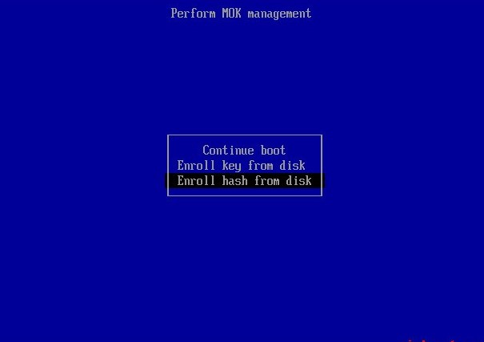
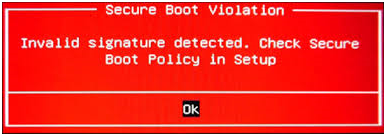
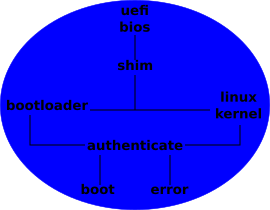

	
	  
   		<strong>
			Create, manage and sign.
		</strong>
	 

<h1>What is MOK</h1>

<b>MOK</b> or <b>Machine Owner Key</b> is a part of a binary set that is signed by <a href="https://www.microsoft.com"><u>Microsoft</u></a> to aid none Windows operating systems to be able to boot without UEFI Secure Boot from being disabled. The main part is the shim.efi bootloader which only has one job and that is to loader either the primary bootloader or kernel, but only if the binary and/or kernel modules are signed and the certificate is registered. If the.

The downside to MOK is that it is not as secure as the certificates that are installed in the UEFI firmware. With some PC's those certificates can be changes. however, doing so can be process and may end in a computer that cannot boot, so only do so at your own risk.

In order to understand what MOK is first you must understand how Secure Boot works. The first step in the boot process is that the BIOS looks for a bootable binary. Once one is located then it attempts to load what ever it may be, in most cases this a a bootloader, but before it is loader the BIOS checks if it is signed and validates the signed file against a public certificate. If however, the file is not signed or that if the key that was use does not match then the system cannot boot.

 Bootloader not signed or signed with wrong certificate. </img>

For operating systems like Ubuntu, Fadora and openSUSE shim is the UEFI signed bootlaoder with only two jobs. Verifying that the primary bootloader (usually GRUB) is signed and that the certificate matches what is loaded into its firmware. If the binary passes the mustard then the initram or kernel is loaded. GRUB by its self doesn't require that a kernel and/or modules be signed unless it is configured to.

If GRUB is not set to load only signed kernels and modules, this can be a small security risk.

<h1>MOKEY (formally MOKUTIL-KEY)</h1>

<b>Mokutil-key</b> was a bash script that was written very dirtily and did not receive any updates for over a year. Mostly because I switched to <a href="https://archlinux.org/"><u>Arch</u></a> and then got stuck on Windows. Sadly, I'm still stuck on Windows, but that is no reason to not do anything was a script that is a fix for a simple problem. So after some time gone I started reworking the script file and soon realized that it was becoming a different animal all together and like everything in natures evolves <b>Mokutil-key</b> had to evolve and so <b>mokey</b> was born.

Most Linux base distributions use MOK for booting with Secure Boot, with the exception of <a href="https://archlinux.org/"><u>Arch</u></a>, but that is not to say that it cannot be done. To learn how to setup Secure Boot on <a href="https://archlinux.org/"><u>Arch</u></a> follow this <a href="https://wiki.archlinux.org/title/Unified_Extensible_Firmware_Interface/Secure_Boot#Using_a_signed_boot_loader"><u>guide</u></a>.

 Boot order for UEFI and SHIM. </img>